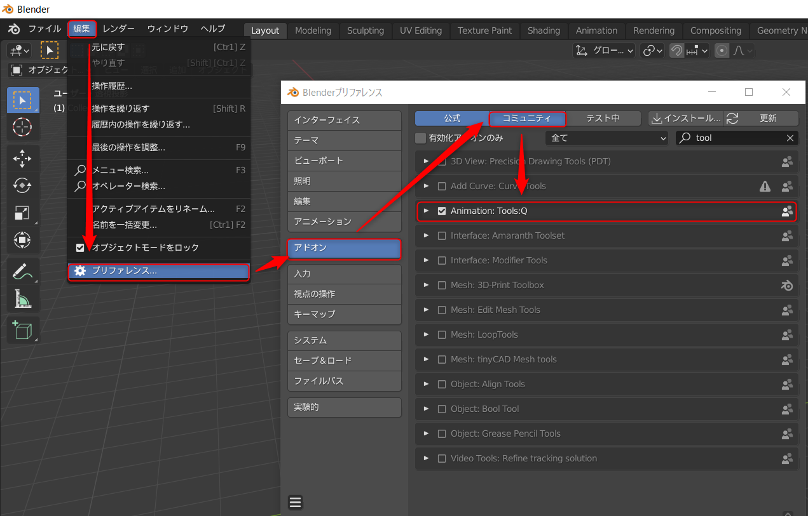

# Tools:Q Animation

[日本語](README.md)

This is a Blender addons for creating animations developed by Project Studio Q inc.

## How to Install

## Testing Environment
- Windows 10 Pro
- Blender 2.93.3, Blender 2.93.5, Blender 3.1

## Addons

- [Align Objects](https://github.com/Project-StudioQ/align_objects/blob/master/README.en.md)
- [Animation Offset Shift](https://github.com/Project-StudioQ/animation_shift/blob/master/README.en.md)
- [Camera Extends](https://github.com/Project-StudioQ/camera_extends/blob/master/README.en.md)

## License

This blender addon is under GNU Public License v2.
