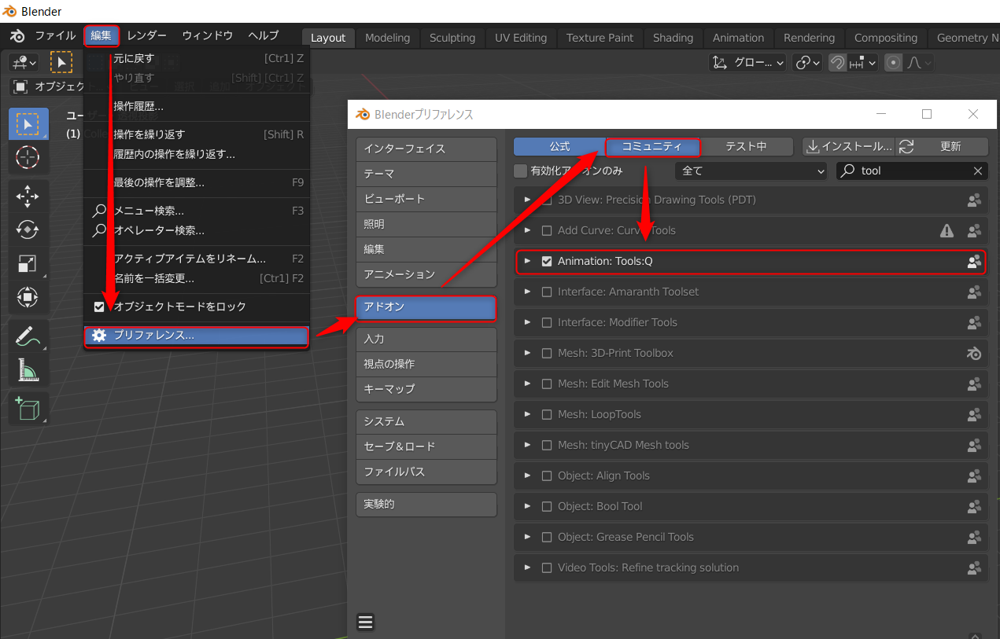

# Tools:Q Animation

[English](README.en.md)

プロジェクトスタジオQで作成、使用している Blender アニメーター向けのアドオンです。

## インストール方法

## 動作確認環境
- windows 10 Pro
- Blender 2.93.3

## 実装機能一覧

- [Align Objects](https://github.com/Project-StudioQ/align_objects)
- [Animation Offset Shift](https://github.com/Project-StudioQ/animation_shift)
- [Camera Extends](https://github.com/Project-StudioQ/camera_extends)

## ライセンス

このBlenderアドオンは GNU Public License v2 です。
